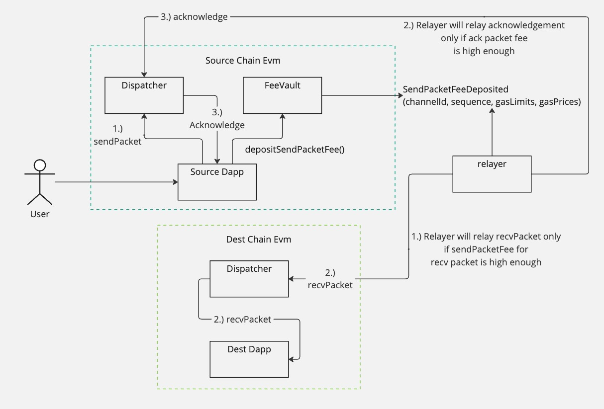

# vIBC Core Smart Contracts

This project includes the core smart contracts for the vIBC protocol, a few demo contracts that simulate testing and serve as a template for integrating dapp devs, and an npm package to aid with deploying and sending transactions to deployed contracts.

## Repo Structure

All contracts internal to this project are in the `contracts`. This directory contains the following subdirectories:
- `core/`: The contracts that are core to the vIBC protocol. These are the contracts that will be deployed and used in production. 
- `interfaces/`: Interfaces for core and testing contracts 
- `libs/`: Libraries used by the core vIbc protocol.
- The `utils/`, `base/`, and `example/` directories all contain contracts that are not core to the vIBC protocol. These contracts are used only for testing or as templates for dapp contracts that will integrate with the vIBC protocol. 

# Core Contracts
## Dispatcher
The Dispatcher contract routes packets to dapps by mapping channels to dapp addresses. The dispatcher also calls packet and channel callbacks on sending/receiving dapps. This contract uses a UUPS proxy compliant with ERC1967 for upgrades. The proxy is intended to be managed by a single owner address, which will be replaced by a multisig in production. 

Since the optimistic light client contract is used to prove that events happened on the Peptide chain, all methods in the dispatcher are permissionless, aside from the methods to set the connection to client mapping, upgrading the implementation, and setting the dispatcher's port prefix. 

Due to the nature of ibc callbacks, the dispatcher should safely be able to integrate its handler methods with any arbitrary (i.e. potentially malicious) contracts. 

The dispatcher can integrate with multiple light clients of the peptide chain to fit differing needs of security and ux. Currently, the dispatcher integrates with the DummyLightClient (used for testing to reduce the need for generating proofs), and the OptimisticLightClient - an EVM implementation of the Optimistic proof verification currently used by Optimism. Support for future clients is also possible. 

Any dapps which send/receive Ibc packets can do so directly through the dispatcher, or through a middleware contract like the `UniversalChannelHandler`. Dapps that directly integrate with the dispatcher are expected to implement the `IbcReceiver` interface, and those which use the `UniversalChannelHandler` are assumed to implement the `IbcUniversalPacketReceiver` interface.

## FeeVault
The FeeVault holds all of the fees sent by users. It has a permissionless withdrawToOwner method which anyone can call which sends all the fees in the feeVault contract directly to the owner.

## OptimisticLightClient
The OptimisticLightClient contract abstracts away proof verification from the dispatcher contract. This light client represents a view of the Polymer chain, and is used to prove that channel handshake and packet sending events happened. 

## OptimisticProofVerifier
The optimisticProofVerifier verifies proofs for the optimistic light client. 

## UniversalChannelHandler
The UniversalChannelHandler is a middleware contract that can be used to save dapps from having to go through the 4-step channel handshake to send or receive Ibc packets. 

## Building Contracts and Testing
This repository uses Foundry for testing and development of smart contracts

## Deploying Contracts
All deployments can either be done through the command line, or through javascript code through importing modules. 
After each deployment, deployment files are saved in deployment artifacts as json files, structured similar to how [hardhat deploy stores its deployment files](https://github.com/wighawag/hardhat-deploy). 

Before deploying, the accounts used to deploy and any constructor arguments must be configured. This configuration can either be read from a yaml file or set through environment variables (see the sections below on how to configure each deployment).

The constructor arguments for each deployment. This supports syntax - which looks through written. You can also specify. 
This file is read in-order, so each entry in this file should be in-order, where dependencies come first and the contract that depends on them comes later.

## Sending Relayer Fees to Polymer 

The vibc protocol is permissionless for channel and packet proof verification and commitment storage. However, a relayer must relay transactions between the source and destination chains. To ease the burden of relaying, Polymer operates a centralized relayer which handles relaying the channel and packet handshake steps across the source, destination, and peptide chains. 

To use Polymer's relayer, users must send fees that offset the gas costs on source, destination, and peptide chains. 

Fees should be sent to the FeeVault contract on the source chain in the form of the native gas token. For example, for sending a packet or opening a chanel from from Optimism to Base chains, fees should be sent in optimism ETH through calling the `depositSendPacketFee` or `depositOpenChannelFee`. Note: fees should never be sent directly to the feeVault, and should *only* be deposited through these methods. 

Sending insufficient fees will result in packets or channels (at any step of the handshakes) to not being relayed by Polymer. 

To account for fluctuating gas prices, Polymer's relayer assumes that the gas prices for each transaction are padded with a margin. Since this margin can be changed, it's recommended to always query the gas prices to send via the [Gas limit api](#fee-estimation ).

### FeeVault address
Since it's possible this FeeVault contract can be updated in the future, it's recommended to always query the FeeVault address from the Dispatcher contract through the `dispatcher.feeVault()` method. Refer to the example `_depositSendPacketFee` and `_depositOpenChannelFee` implementations in the abstract FeeSender contract. 

It's important to note: 
- Any fees directly sent to the FeeVault contract will not be credited to the packet or channel. Use the provided `depositSendPacketFee` and `depositOpenChannelFee` methods instead.
- These methods will revert if the total value sent in the transaction  doesn't *exactly* add up to the total gasPrices*gasLimits. This is done to simplify accounting, avoid fee griefing and also to protect users from sending accidentally too many fees.
- Though the example contracts call these methods from a dapp, feeVault methods are permissionless for any packet and channel, and can also be called by EOAs directly
- All fee deposits are final and cannot be withdrawn

## Fee estimation
Before calling the `depositSendPacketFee` or `depositOpenChannelFee` methods, users must estimate the fees to send. This can be done through the FeeEstimator API. 

For both channel and packet handshakes, this api serves:
- An `/estimateGas` endpoint, where users pass in gasLimits and are returned the gasPrices to send to the feeVault contract 
- A `/estimateDynamicGas` endpoint, where a packet's gasLimits are estimated using the `eth_estimateGas` gRPC endpoint, and returned by the api. Note: this api shouldn't be used for contracts where the gas estimation is time dependent or vary's widely with time as it can result in inaccurate fee estimation.

## Fee Specifics for Channels vs Packet Handshake
There's a few specifics to sending packet fees vs channel fees:

### Channel Fees

Given their complexity and relative infrequency, fees for channel handshakes are collected in a single lump sump. This amount is to be negotiated with the Polymer team by dapp which is opening the channel. 

Note: The Universal Channel for each chain pair can be used to send messages without having to do the channel handshake, and thus to avoid having to send channel handshake fees. 

### Packet Fees

Since the first step of the packet handshake (calling sendPacket on the source chain) is initiated by the user dapp and not the relayer, the fees for the first step do not need to be sent to the fee vault. Thus, even though the sendPacket handshake has 3 steps, the user only needs to deposit fees to the FeeVault for the latter two steps:

- calling `dispatcher.recvPacket` on the destination chain
- calling `dispatcher.acknowledge` on the source chain

For both of these calls, 2 values each must be sent to the FeeVault contract:
- gasLimit: The estimated gas for the transaction
- gasPrice: The gasPrice for the transaction. For non-legacy transactions, this is equivalent to the maxFeePerGas.  

These 4 values (i.e. gasLimit and gasPrice for both the send and recv packet steps) are encoded as 2 arguments sent in the depositSendPacketFee method. The `gasLimits` argument is a 2 element array, where the first element is the gas limit for the recvPacket call, and the second element is the gas limit for the acknowledge call. The `gasPrices` is a 2 element array, where the first element is the gas price for the recvPacket call, and the second element is the gas price for the acknowledge call.

Note: A call to the FeeVault contract will revert if the total value sent in the transaction's `msg.value` doesn't *exactly* add up to the total (gasLimits[0]*gasPrices[0] + gasLimits[1] * gasPrices[1]). 

Since the gasPrices are padded with a margin to account for fluctuating gas prices, it's recommended to always query the fee estimator asi for most up-to-date gas prices.

