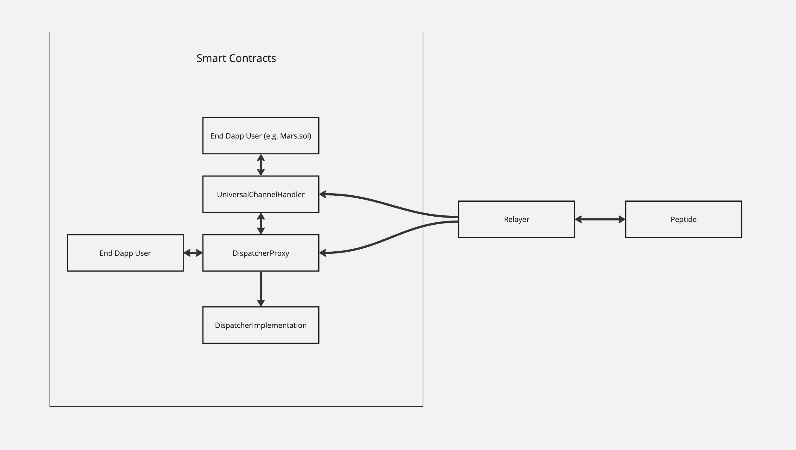

# vIBC Core Smart Contracts

This project includes the core smart contracts for the vIBC protocol, a few demo contracts that simulate testing and serve as a template for integrating dapp devs, and an npm package to aid with deploying and sending transactions to deployed contracts.




## Repo Structure

All contracts internal to this project are in the `contracts`. This directory contains the following subdirectories:
- `core/`: The contracts that are core to the vIBC protocol. These are the contracts that will be deployed and used in production. 
- `interfaces/`: Interfaces for core and testing contracts 
- `libs/`: Libraries used by the core vIbc protocol.
- The `utils/`, `base/`, and `example/` directories all contain contracts that are not core to the vIBC protocol. These contracts are used only for testing or as templates for dapp contracts that will integrate with the vIBC protocol. 


# Core Contracts
## Dispatcher
The Dispatcher contract routes packets to dapps by mapping channels to dapp addresses. The dispatcher also calls packet and channel callbacks on sending/receiving dapps. This contract uses a UUPS proxy compliant with ERC1967 for upgrades. The proxy is intended to be managed by a single owner address, which will be replaced by a multisig in production. 

Since the optimistic light client contract is used to prove that events happened on the Polymer chain, all methods in the dispatcher are permissionless, aside from the methods to set the connection to client mapping, upgrading the implementation, and setting the dispatcher's port prefix. 

Due to the nature of ibc callbacks, the dispatcher should safely be able to integrate its handler methods with any arbitrary (i.e. potentially malicious) contracts. 

The dispatcher can integrate with multiple light clients of the peptide chain to fit differing needs of security and ux. Currently, the dispatcher integrates with the DummyLightClient (used for testing to reduce the need for generating proofs), and the OptimisticLightClient - an EVM implementation of the Optimistic proof verification currently used by Optimism. Support for future clients is also possible. 

Any dapps which send/receive Ibc packets can do so directly through the dispatcher, or through a middleware contract like the `UniversalChannelHandler`. Dapps that directly integrate with the dispatcher are expected to implement the `IbcReceiver` interface, and those which use the `UniversalChannelHandler` are assumed to implement the `IbcUniversalPacketReceiver` interface.

## OptimisticLightClient
The OptimisticLightClient contract abstracts away proof verification from the dispatcher contract. This light client represents a view of the Polymer chain, and is used to prove that channel handshake and packet sending events happened. 

## OptimisticProofVerifier
The optimisticProofVerifier verifies proofs for the optimistic light client. 

## UniversalChannelHandler
The UniversalChannelHandler is a middleware contract that can be used to save dapps from having to go through the 4-step channel handshake to send or receive Ibc packets. 

## Building Contracts and Testing
This repository uses Foundry for testing and development of smart contracts

## Deploying Contracts
All deployments can either be done through the command line, or through javascript code through importing modules. 
After each deployment, deployment files are saved in deployment artifacts as json files, structured similar to how [hardhat deploy stores its deployment files](https://github.com/wighawag/hardhat-deploy). 

Before deploying, the accounts used to deploy and any constructor arguments must be configured. This configuration can either be read from a yaml file or set through environment variables (see the sections below on how to configure each deployment).

The constructor arguments for each deployment. This supports syntax - which looks through written. You can also specify. 
This file is read in-order, so each entry in this file should be in-order, where dependencies come first and the contract that depends on them comes later.

### Deploying via Command Line 
This npm package exposes two commands - one to deploy new contacts (which automatically creates persisted deployment files), and one to send transactions to contracts from persisted artifact files. The following steps are needed to deploy contracts via the command line: 

1. Ensure that your deployer account and constructor arguments are configured. This can either be done through adding contract spec yaml files located in the specs/ from the root of where this npm module is installed from (requires adding a `specs/evm.accounts.yaml` file and either a `specs/contracts.spec.yaml` or  `specs/upgrade.spec.yaml`), or by setting the KEY_POLYMER, RPC_URL, DEPLOYMENT_CHAIN_ID, CHAIN_NAME environment variables. For examples of contract and account spec files, see the `/specs` folder in this repo.
2. Run either `npx deploy-vibc-core-smart-contracts` to deploy contracts from the contract spec, or `npx upgrade-vibc-core-smart-contracts` to  send an upgrade transaction.

### Deploying via imports 
Deployments can also be done through calls through the `deployToChain` and the `sendTxToChain` methods. 

#### Deploying new contracts via imports

```
import {
  AccountRegistry,
  Chain,
  ContractRegistryLoader,
  deployToChain,
  parseObjFromFile,
} from "@open-ibc/vibc-core-smart-contracts";

import { getMainLogger } from "@open-ibc/vibc-core-smart-contracts/utils/cli";
import { DEFAULT_RPC_URL } from "../utils/constants";

// Or can parse it form the env
const accountConfig = {
  name: "local",
  registry: [
    {
      name: "KEY_POLYMER",
      privateKey: process.env.KEY_POLYMER
    },
  ],
};

const accounts = AccountRegistry.loadMultiple([accountConfig]);
const contracts = ContractRegistryLoader.loadSingle(
  parseObjFromFile("specs/contracts.spec.yaml")
);

const chain: Chain = {
  rpc: process.env.RPC_URL ,
  chainId: process.env.DEPLOYMENT_CHAIN_ID,
  chainName: process.env.CHAIN_NAME,
  vmType: "evm",
  description: "local chain",
};

deployToChain(
  chain,
  accounts.mustGet(chain.chainName),
  contracts.subset(),
  getMainLogger(),
  false
);
```

similar to the command line deploy, this will create a deployment artifact file in the `deployments/` folder.

#### Upgrading existing contracts via imports
Proxy upgrades to existing contracts can be done through the `sendTxToChain` method :

```
#!/usr/bin/env node
import {
  AccountRegistry,
  Chain,
  parseObjFromFile,
} from "@open-ibc/vibc-core-smart-contracts";
import { loadTxRegistry } from "@open-ibc/vibc-core-smart-contracts/evm/schemas/tx";
import { sendTxToChain } from "@open-ibc/vibc-core-smart-contracts";

import { getOutputLogger } from "@open-ibc/vibc-core-smart-contracts/utils/cli";
// Or can parse it form the env
const accountConfig = {
  name: "local",
  registry: [
    {
      name: "KEY_POLYMER",
      privateKey: process.env.KEY_POLYMER,
    },
  ],
};

const accounts = AccountRegistry.loadMultiple([accountConfig]);
const upgradeTxs = loadTxRegistry(parseObjFromFile("specs/upgrade.spec.yaml"));

const chain: Chain = {
  rpc: process.env.RPC_URL,
  chainId: process.env.CHAIN_ID,
  chainName: "local",
  vmType: "evm",
  description: "local chain",
};

sendTxToChain(
  chain,
  accounts.mustGet(chain.chainName),
  upgradeTxs.subset(),
  getOutputLogger(),
  false
);
```

