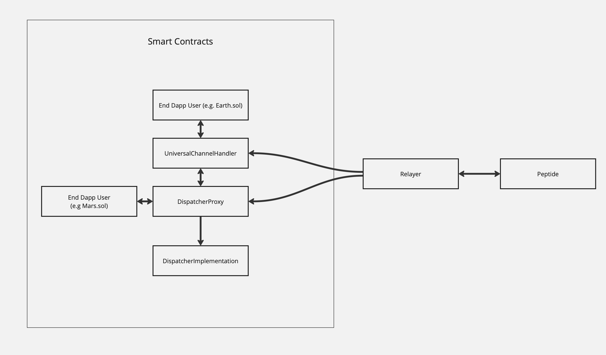

# Vibc-Core-Smart-Contracts

This package includes the core smart contracts for the vIBC protocol, a few demo contracts that simulate testing and serve as a template for integrating dapp devs, and utils to aid with deploying and sending transactions to deployed contracts.

The contracts are tested and compiled using [Foundry](https://book.getfoundry.sh), and deployment utils are implemented as exported JavaScript functions and binaries that can be run as `npx` commands.

The following functionality is supported from this package: 
- Deploying and sending transactions to contracts from a single yaml file that describes a deployment spec (see specs section) 
- Running a simple fork testing which does a channel and packet handshake before deploying
- Saving deployed contract data (e.g. deployed address, contract names, factories, compiler info) as json artifacts, structured similar to how [hardhat deploy stores its deployment files](https://github.com/wighawag/hardhat-deploy).  
- Sending transactions to persisted contracts
- Proposing transactions from a multisig
- Verifying contracts from deployment artifacts

The above functionality can be utilized through a terminal through npx commands or through importing the modules and calling the exposed functions directly. 

### Argument Hierarchy
Arguments to these scripts can be specified through multiple inputs. Thus it's important to note that the hierarchy of configuration variables is: 
- any arguments passed in via command line always take precedent over arguments in the env and default arguments
- any arguments from the env override any default arguments
- default arguments as defined in src/utils/constants.ts are used if no other arguments are passed in.

For example if you pass in a `--RPC_URL=http://localhost:8545` argument to the command line, the RPC_URL will be set to `http://localhost:8545` regardless of what is set in the env.

## Accounts Spec
To send transactions or deploy any contracts, they must be signed from a private key. These private keys are described in accounts spec files.

Accounts can either be normal evm accounts or multisig accounts. 

Normal accounts contain the following fields:
- name - the name of the account, this can be referenced in the contracts update spec file in the `deployer` attribute. 
- private key - the private key of the account. To avoid having to persist private keys in this account spec, you can also reference env variables through enclosing them in double brackets. For example, if there is a `DEPLOYER_PRIVATE_KEY` variable set in the environment that runs a command that references this account spec, you can set the private key attribute to `{{DEPLOYER_PRIVATE_KEY}}` and this will be rendered to the environment value during runtime. 

Multisig accounts contain the following fields: 
- name: The name of the account similar to normal accounts
- private key: Private key of an owner account associated with the multsig account at the safeAddress.  Similar to normal accounts, you can reference env variables through enclosing them in double brackets.
- safeAddress: The address of the multisig contract 
- chainId : The chainId this multisig account exists on.

You can create a multisig account from a normal account using the `npx vibc-core-deploy-multisig` command. This will modify the account spec file you run the command with to add the `safeAddress` and `chainId` fields. 

## Contract Update Spec
A contract update spec is a yaml file that describes a set of transactions to deploy and update contracts. Instead of having to reference all contracts by addresses, you can reference previously deployed addresses by name.

Update transactions can be one of either a contract deployment, or a contract update.

### Contract Deployment Transactions 
Contract deployments deploy contracts and contain the following params:
- name: Name of the contract deploy artifact that will be generated. You can reference this contract's address via this name after this deployment transaction has completed  
- deployer: The account to deploy this contract from. Must be the name of an entry in the [accounts spec](#accounts-spec)
- description: Description of contract, used for logging 
- factoryName: The name of the typechain factory used to deploy the contract, corresponds to a contract name in the contracts/ folder. 
- libraries: If a contract depends on external libraries, the location of the library file & the deployed library address can be specified here, as an array with multiple elements
- deployArgs: The arguments that will be called in the contract constructor. Note: if $INITARGS is passed in as an argument, the arguments will be abi-encoded and passed to the init parameter 
- init: any arguments that need to be abi encoded (e.g. for calling upgradeToAndCall for ERC1967Proxy). These will be rendered in the place of $INITARGS

### Contract Update Transactions
Contract updates are transactions that are sent to contracts. These can be useful for things like proxy upgrades, ownership transfers, or calling setter methods. They need to contain the following params:
- name: Name of the contract deploy artifact that will be generated. You can reference this contract's address via this name after this deployment transaction has completed 
- factoryName: Factory name to use to encode the function arguments 
- deployer: The account to send this transaction from. Must be the name of an entry in the [accounts spec](#accounts-spec)
- address: address of contract to call this method on, can either be a literal address string or can reference a deployment artifact name
- signature: Signature of method to call for this tx, e.g. `transferOwnership(address)` 
- args: An array of args to make the function call with, need to be compatible with the signature

### Contract Deployment Artifacts
For contract deployments, a new json deployment file will be created that contains the name you give the contract deployment, the address, contract version, and the compiler metadata.

The deployment files are saved by default to: `deployments/<CHAIN_ID>/<DEPLOYMENT_ENVIRONMENT>/<CHAIN_ID>-<DEPLOYMENT_NAME>.json`

Where `DEPLOYMENT_ENVIRONMENT` is one of `staging`, `production`, `local`, or `mainnet`, and `CHAIN_ID` is the chain id of the chain the contract is deployed to, and `DEPLOYMENT_NAME` is the name given to the contract in the update spec.

## Deploying via Command Line 

The following commands are exported as binaries and can be run through a terminal:  
- `npx update-vibc-core-smart-contracts` - Deploy or send transactions to deployed contracts.  
- `npx vibc-core-deploy-test` - runs a fork test that does a channel and packet handshake before deploying
- `npx vibc-core-deploy-multisig` - deploys a multisig contract
- `npx vibc-core-execute-multisig-tx` - executes a transaction from a multisig account referenced in the accounts spec that has  

Note: the following commands are deprecated and will be soon removed:
- `npx deploy-vibc-core-smart-contracts` - Use `npx update-vibc-core-smart-contracts` instead. 
- `npx setup-vibc-core-dispatcher` - Use `npx update-vibc-core-smart-contracts` instead. 

### Updating Vibc-Core Smart Contracts 

Note: It's always recommended to test your contract update config spec through a fork-test using the `npx vibc-core-deploy-test` command before running this command.

The `npx update-vibc-core-smart-contracts` command sends all transactions defined in a [contract update spec](#contract-update-spec). It takes the following arguments, to be described either via CLI arguments or the :
- `RPC_URL` - the rpc url to broadcast signed txs to, can be a local fork as well
- `CHAIN_NAME` - the name of the chain to deploy to, used mainly for logging
- `CHAIN_ID` - the chain id of the chain to deploy to, this impacts the location of any deployment artifacts created from this file.
- `UPDATE_SPECS_PATH` - the path to the [contract update spec file](#contract-update-spec)
- `ACCOUNT_SPECS_PATH` - the path to the [accounts spec file](#accounts-spec)
- `DEVELOPMENT_ENVIRONMENT` - the environment to deploy to, should be one of staging, production, local, or mainnet

### Fork testing 
The `npx vibc-core-deploy-test` command runs [this fork test](https://github.com/open-ibc/vibc-core-smart-contracts/blob/main/test/Fork/Dispatcher.deploy.t.sol) after deploying a given update spec onto a forked network. This test does a channel and packet handshake to ensure there are no storage collisions from proxy upgrades, and no major contract constructor misconfigurations. 

This is useful for testing the contract update spec before deploying it to a live chain. It's recommended to always run this command before running the `npx update-vibc-core-smart-contracts` command.

This command takes the same arguments as the `npx update-vibc-core-smart-contracts` command. The only difference is that the transactions aren't broadcasted to the `RPC_URL`, but instead are run on a forked chain. 

### Deploying multisig Command Line

The `npx vibc-core-deploy-multisig` command deploys a multisig contract using the [Gnosis Safe Api Kit](https://docs.safe.global/sdk/api-kit). It takes the following arguments:

- `INITIATOR` - The name of the account to initiate the multisig deployment from. Must be the name of an entry in the [accounts spec](#accounts-spec). This initiator will also be one of the multisig owners.
- `ACCOUNTS_SPECS_PATH` - the path to the [accounts spec file](#accounts-spec) that the new multisig account will be saved to.
- `RPC_URL` - the rpc url to broadcast signed txs to. This must be an RPC corresponding to one of the [Safe supported networks](https://docs.safe.global/core-api/transaction-service-supported-networks). 
- `OWNERS` - An array of addresses to add as owners to the multisig. You can append multiple owners to this argument via cli by specifying the --OWNERS flag multiple times.
- `THRESHOLD` - The number of owners required to confirm a transaction. Must be less than or equal to the number of owners.

This will automatically modify the accounts spec to include the new safeAddress and the chainId in a new multisig account. The name of the multisig account is the name passed in as the INITIATOR account, suffixed with a "_MULTISIG". After running this command, this newly created account can directly be referenced in a contract update spec, and this package will automatically propose transactions from the multisig account. 

### Confirming Multisig Transactions
Confirming multisig transactions isn't implemented in these scripts since it's assumed that confirming should be manually verified and executed through the other multisig owners, and that multiple multisig private keys should not be held in a single location.  Confirming multisig transactions can be done via the Gnosis Safe UI. 

###  Executing multisig transactions via Command Line

Once a multisig transaction has enough transactions to be executed, you can execute it using the `npx vibc-core-execute-multisig-tx` command. This command takes the following arguments:
- `EXECUTOR` - The name of the account to execute the multisig transaction from. Must be the name of an entry in the [accounts spec](#accounts-spec). 
- `ACCOUNTS_SPECS_PATH` - the path to the [accounts spec file](#accounts-spec) that the multisig account is saved to.
- `RPC_URL` - the rpc url to broadcast signed txs to. This must be an RPC corresponding to one of the [Safe supported networks](https://docs.safe.global/core-api/transaction-service-supported-networks). 
- `TX_INDEX` the index of the transaction to execute in the safe's pending tx queue.  
